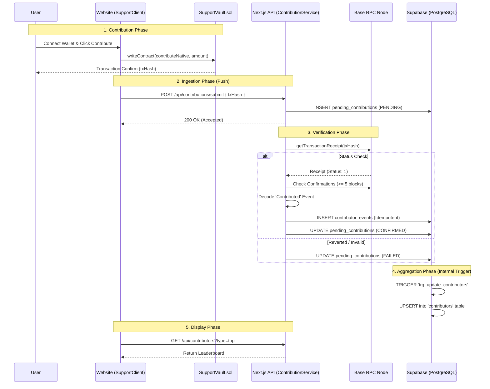

# Contribution System Architecture

This document provides a comprehensive overview of the "Show Your Support" system, including the smart contract, push-based ingestion, legacy indexer, database, and frontend components.

## 1. System Overview

The system allows users to contribute native ETH (Base Mainnet) to support the project. Contributions are tracked on-chain.
**NEW (Enterprise):** Real-time ingestion is now "Push-Based". The frontend submits the transaction hash to the backend, which verifies the receipt against the blockchain node. The legacy indexer is reserved for historical catch-up only.

### Architecture Diagram



---

## 2. Contribution Lifecycle

Transactions move through three states in `pending_contributions`:

| Status | Description |
| :--- | :--- |
| **pending** | Transaction submitted, waiting for verification or confirmations (5 blocks). |
| **confirmed** | Receipt verified, event decoded, and data ingested into `contributor_events`. |
| **failed** | Invalid receipt, reverted tx, wrong contract, or no event found. |

### Enterprise Features
*   **Idempotent:** Safe to retry submitting the same `txHash` multiple times.
*   **Reorg Safe:** Requires 5 verifications (blocks on top) before confirming.
*   **Audit Trail:** Errors are logged with codes (e.g., `FAILED_REVERTED`, `FAILED_WRONG_CONTRACT`).
*   **Auto-Retry:** A background worker retries `pending` items that got stuck (up to 10 times).

---

## 3. Key Components & Files

### A. API Layer (New)
*   **Service:** [`apps/api/src/services/ContributionService.ts`](file:///e:/website%20development/GChain%20Receipt/apps/api/src/services/ContributionService.ts)
    *   Handles receipt verification validation.
*   **Endpoint:** `POST /api/contributions/submit`
*   **Worker:** [`apps/api/scripts/retry_contributions.ts`](file:///e:/website%20development/GChain%20Receipt/apps/api/scripts/retry_contributions.ts)

### B. Smart Contract Layer
*   **File:** [`packages/contracts/contracts/SupportVault.sol`](file:///e:/website%20development/GChain%20Receipt/packages/contracts/contracts/SupportVault.sol)
*   **Role:** Securely holds funds and emits `Contributed` events.

### C. Database Layer
*   **New Table:** `pending_contributions` (Tracks ingestion state).
*   **Core Tables:** `contributor_events` (Immutable logs), `contributors` (Aggregated stats).
*   **Legacy:** `indexer_state` (Only used by backfill indexer).

### D. Legacy Indexer
*   **File:** [`apps/api/src/services/IndexerService.ts`](file:///e:/website%20development/GChain%20Receipt/apps/api/src/services/IndexerService.ts)
*   **Status:** **DEPRECATED for live traffic.** Use only for database reconstruction.

---

## 4. Operational Guide

### Manual Verification
To manually retry or verify a specific transaction hash:
```bash
# Force re-submit via CURL (Idempotent)
curl -X POST http://localhost:3001/api/contributions/submit \
     -H "Content-Type: application/json" \
     -d '{"txHash": "0x..."}'
```

### Running the Retry Worker
The worker should run systematically (e.g., via Cron every 5 minutes).
```bash
npx ts-node apps/api/scripts/retry_contributions.ts
```

### Legacy Backfill
If the database is lost, use the legacy indexer to rebuild history:
```bash
npx ts-node apps/api/scripts/run_indexer.ts --backfill
```

---

## 5. Troubleshooting (New Architecture)

| Issue | Cause | Fix |
|Str|Str|Str|
| **Stuck in `pending`** | Not enough confirmations (<5 blocks) or RPC lag. | Wait or run `retry_contributions.ts`. |
| **`failed` (FAILED_NO_EVENT)** | Transaction succeeded but `Contributed` event is missing. | Check if the tx was sent to correct proxy/contract. |
| **`failed` (FAILED_WRONG_CONTRACT)** | `tx.to` does not match ENV `SUPPORT_VAULT_ADDRESS`. | Verify frontend ENV vs backend ENV. |
