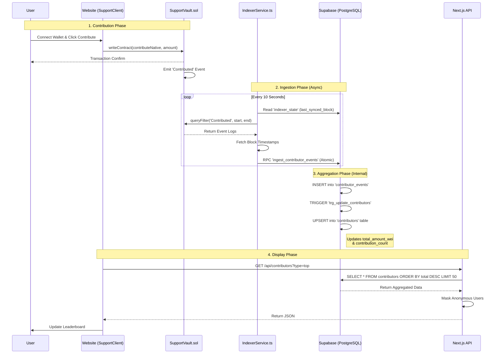

# Contribution System Architecture

This document details how the Contribution System works, from the on-chain event to the frontend display.

## System Overview Diagram



## Detailed Component Breakdown

### 1. The Smart Contract (`SupportVault.sol`)
The source of truth is the blockchain.
- **File**: `packages/contracts/contracts/SupportVault.sol`
- **Function**: `contributeNative(bool isAnonymous)`
- **Safety**: Enforces a minimum contribution amount and a cooldown period to prevent spam.
- **Event**: Emits `Contributed(address contributor, address token, uint256 amount, bool isAnonymous, uint256 timestamp)`.

### 3. **Event-Driven Indexer Service**  
**Path:** `apps/api/src/services/IndexerService.ts`  

Instead of constant polling, the system now uses an **Event-Driven / Hybrid Approach**:
*   **Passive Mode (Default):** The indexer sleeps for **24 hours** to save RPC costs.  
*   **On-Demand Trigger:** Exposes a `triggerSync()` method via the API.  
*   **Workflow:**  
    1.  User contributes on Frontend.  
    2.  Frontend calls `POST /api/v1/indexer/trigger`.  
    3.  Indexer wakes up immediately, fetches the new event, and updates the database.  
    4.  Indexer goes back to sleep.  

**Key Features:**
*   **Smart Sync:** Only wakes up when needed or once a day.  
*   **Atomic Ingestion:** Uses `rpc('ingest_contributor_events')` to ensure data consistency.
*   **Resiliency:** If "Far Behind", it automatically switches to "Fast Sync" mode (no sleep) until caught up.

### 3. Database & Aggregation (`schema.sql`)
The database handles the heavy lifting of calculating totals automatically.
- **File**: `packages/database/migrations/schema.sql`
- **Tables**:
    - `contributor_events`: An immutable log of every single donation ever made (including `is_anonymous`).
    - `contributors`: A summary table that stores the current totals for each user (respecting `is_anonymous`).
- **Trigger Logic**:
    - A PostgreSQL Trigger (`trg_update_contributors`) listens for new rows in `contributor_events`.
    - When a new event arrives, it automatically updates the `contributors` table:
        - If the user is new: Creates a new row.
        - If the user exists: Adds the new amount to `total_amount_wei` and increments `contribution_count`.
    - **Why?**: This makes reading the leaderboard extremely fast (O(1)) because the math is already done.

### 4. Ranking Logic (Who is Top Contributor?)
- **Logic**: The ranking is purely based on the cumulative `total_amount_wei`.
- **Query**: In `apps/web/src/app/api/contributors/route.ts`:
  ```typescript
  supabase.from('contributors')
      .select('*')
      .order('total_amount_wei', { ascending: false })
      .limit(50);
  ```
4.  **Privacy Layer:**  
    *   The Smart Contract accepts an `isAnonymous` boolean.  
    *   Indexer saves this flag to the database.  
    *   API returns `displayName: "Anonymous Supporter"` if the flag is true.  
    *   Frontend allows users to toggle this preference before contributing.  

5.  **Dynamic Updates:**  
    *   Frontend polls the API every 60 seconds.  
    *   **Instant Feedback:** After a contribution, the frontend triggers the indexer and refreshes the list within 5 seconds.

### 5. Frontend (`SupportClient.tsx`)
- **File**: `apps/web/src/app/support/SupportClient.tsx`
- **Action**: fetches data from `/api/contributors` on mount.
- **Display**: Shows a Top 50 leaderboard using the pre-calculated data. Creates a transaction to the smart contract when the user donates.
